# Kerberus Web

> **URL** : [`http://ec2-54-238-131-125.ap-northeast-1.compute.amazonaws.com`](http://ec2-54-238-131-125.ap-northeast-1.compute.amazonaws.com)

## 1. 호스팅 운영체제 환경

~~~

    ubuntu@ip-172-31-39-98:~$ cat /etc/*release
    DISTRIB_ID=Ubuntu
    DISTRIB_RELEASE=16.04
    DISTRIB_CODENAME=xenial
    DISTRIB_DESCRIPTION="Ubuntu 16.04.5 LTS"
    NAME="Ubuntu"
    VERSION="16.04.5 LTS (Xenial Xerus)"
    ID=ubuntu
    ID_LIKE=debian
    PRETTY_NAME="Ubuntu 16.04.5 LTS"
    VERSION_ID="16.04"
    HOME_URL="http://www.ubuntu.com/"
    SUPPORT_URL="http://help.ubuntu.com/"
    BUG_REPORT_URL="http://bugs.launchpad.net/ubuntu/"
    VERSION_CODENAME=xenial
    UBUNTU_CODENAME=xenial

~~~

## 2. 사용 기술

| Frontend | Backend | Database | Hosting |
|:--------:|:--------:|:-------:|:-------:|
| `HTML5` | `Node.js` | `MySQL`| `Amazon Web Service`
| `CSS3` | `Express.js` | `Amazon RDS` |
| `JavaScript` | `Cors.js` | |
| `React.js` | `Async.js` | |
| `Redux.js` |  | |
| `Canvas.js` | | |

## 3. 개발 목적

> 유튜브 SNS 플랫폼에서 특정 검색어로 검색된 여러 영상을 높은 관련성을 기준으로 접근하여 유저들의 댓글을 크롤링, Cloud 데이터베이스에 저장. 이후 형태소 분석 및 감정 분석 프로세싱하여 결과 데이터에 대한 시각화.

> 예상 서비스 이용자는 IT/제품 구매자가 여러 동급의 IT 제품 라인업에서 어떤 제품을 구매할지 고민이 되는 경우 신속하게 제품간 하드웨어 성능을 취합하여 제시하고
긍정도 , 부정도가 높은 댓글들을 바로 살펴보게 함으로써 유저 반응이 어떤지도 기존 유튜브 플랫폼에서 제공하는 정보보다 빠르게 제공한다.

## 4. 구성 요소

- What is it? : Kerberus 서비스에 대한 설명과 안내
- DashBoard : Kerberus 서비스의 이용과 데이터에 대한 상황 안내
- Category : 데이터베이스내에 저장된 하위 카테고리에 대한 네비게이션, 해당 카테고리에 대한 데이터 상태와 저장된 제품들을 나열한다.
- CategoryContentBox : 나열된 제품에 대한 상세정보를 나타내기 위한 컴포넌트, 제품에 대한 선호도 , 감정 분석 결과 , 긍정 및 부정 지수가 높은 댓글들을 나열합니다.
- Comparison : 제품간 하드웨어 사양 비교를 위한 컴포넌트, 다중 제품에 대한 가격 비교 , 감정 분석 긍부정 수치 비교 , 하드웨어 사양 비교

## 5. 개발 화면

### 1. Index

#### (Wide View)

 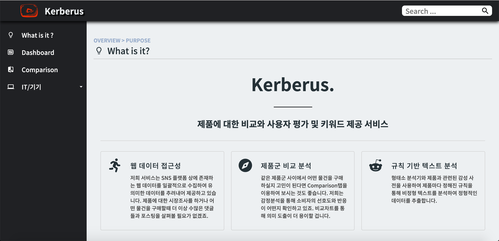

#### (Narrow View)

 

### 2. Comparison

#### (Wide View)

 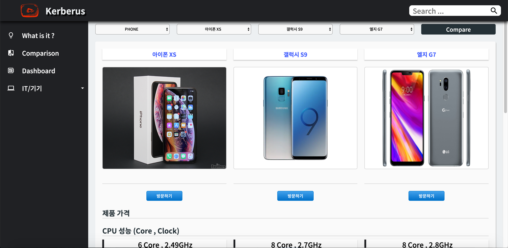

#### (Narrow View)

 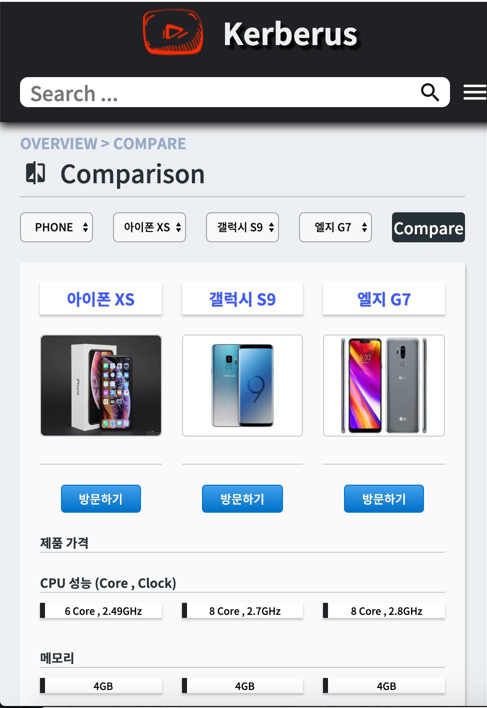

#### (Price Compare Today)

 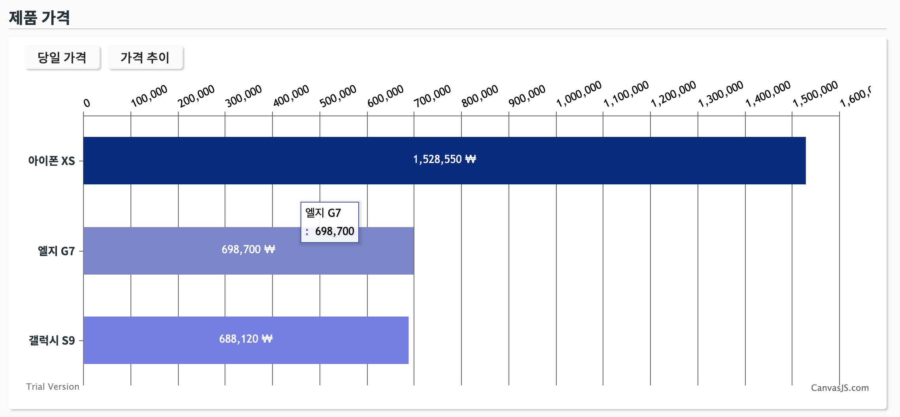

 #### (Price Compare Week)

 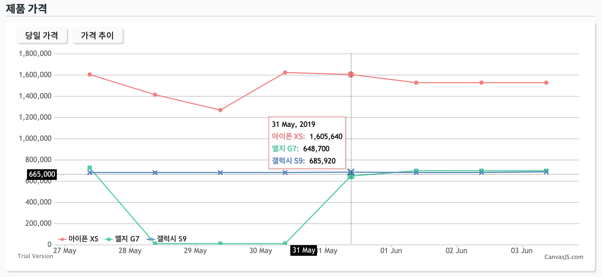

 #### (Preference Compare)

 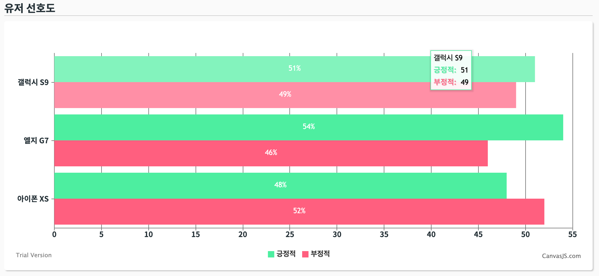

### 3. Dashboard 

#### (Wide View)

 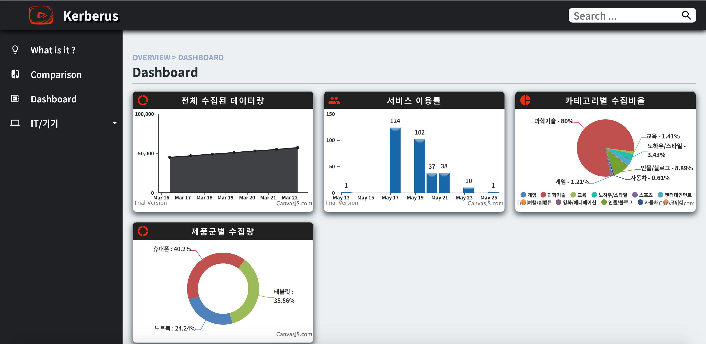

#### (Narrow View)

 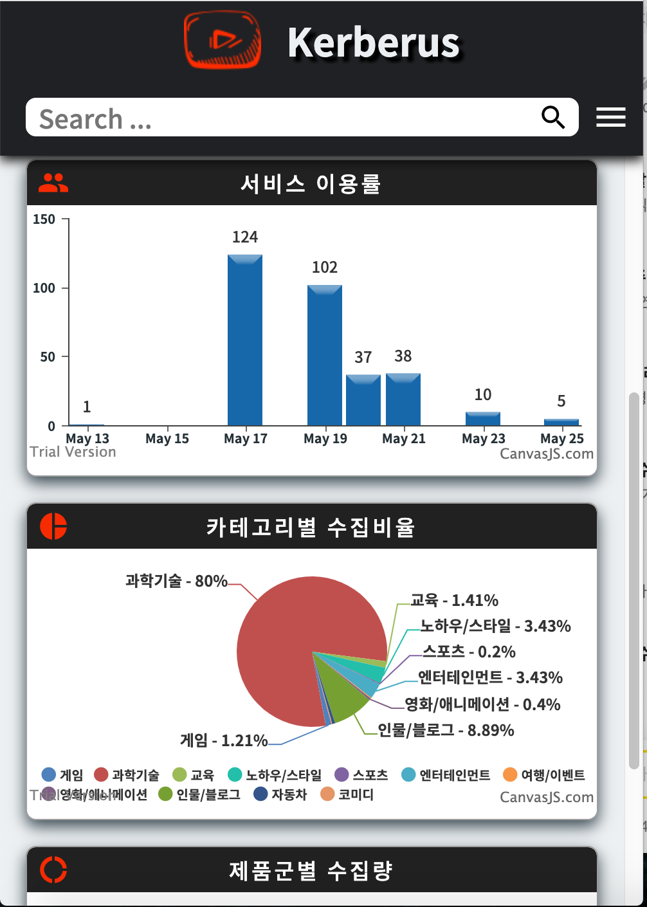

### 4. Category 

#### (Wide View)

 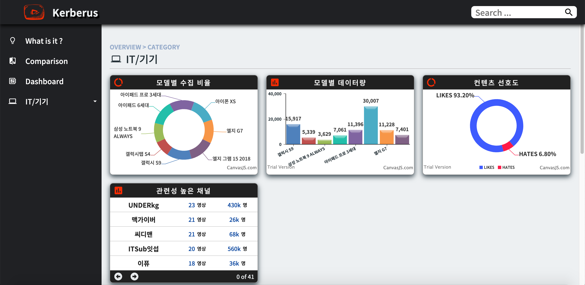

#### (Narrow View)

 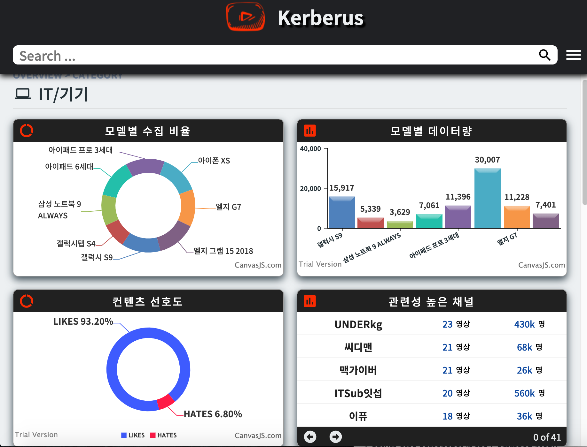

### 5. Product List

#### (Wide View)

 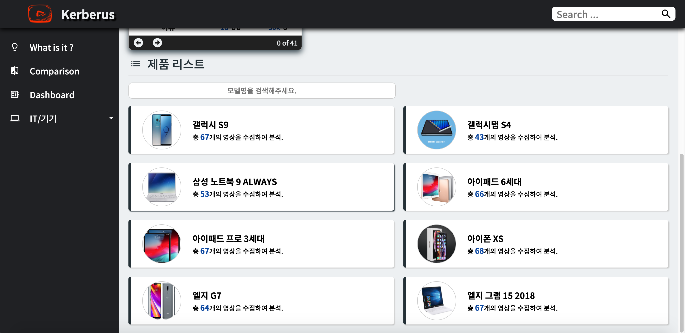

#### (Narrow View)

 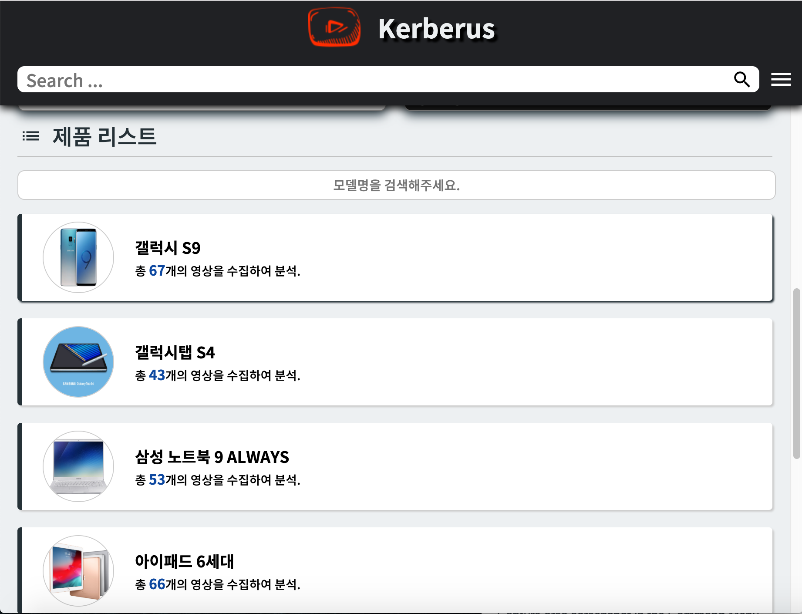

### 6. Product Info

#### (Wide View)

 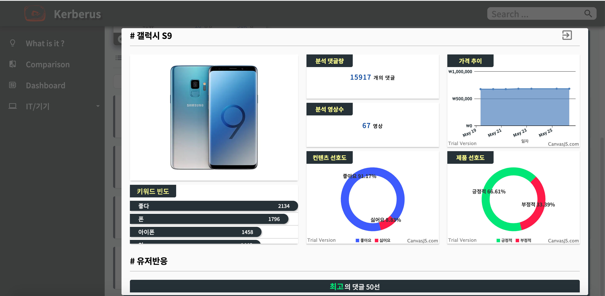

#### (Narrow View)

 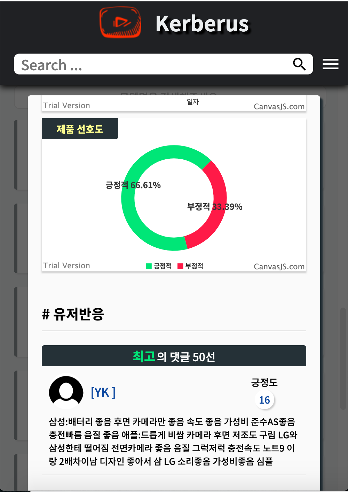

### 7. Product Replys

#### (Wide View , Positive)

 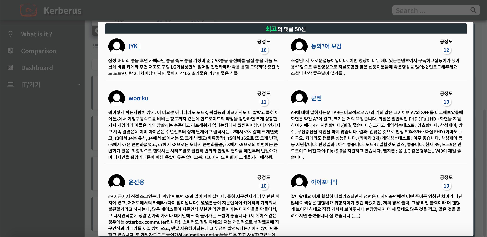

#### (Wide View , Negative)

 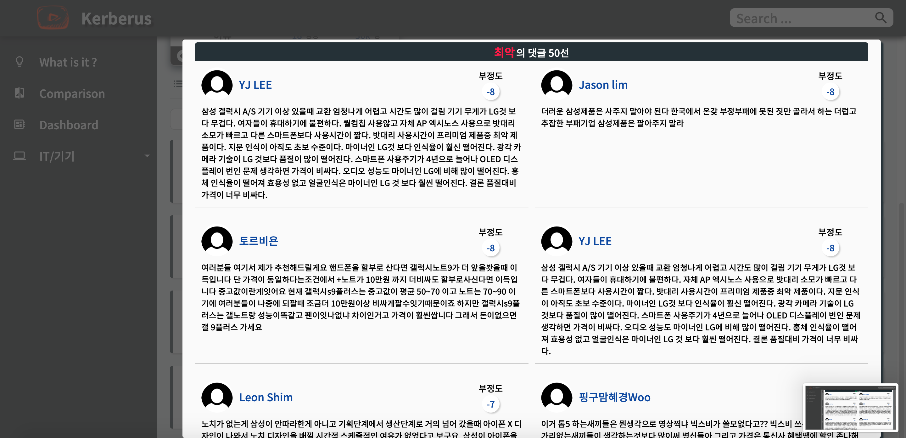

